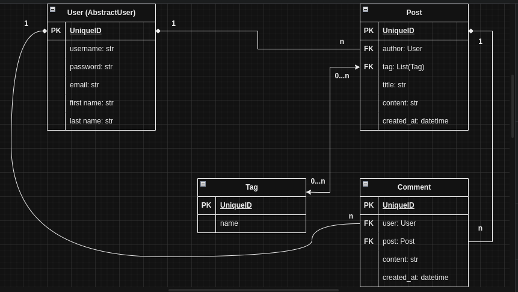

# IT Blog "MATRIX"

A blog that allow you to find, share and create information about the world of IT, inspired by the aesthetic and themes
of the Matrix film franchise.

## Check it out!

Check my project at render: [MATRIX]()

For login use following login and password:
* Login: `neo`
* Password: `1qazcde3`

## Technological stack

For this project I used:
> * python 3.11
> * Django 5.0.3
> * django-crispy-forms 2.1
> * crispy-bootstrap5 2024.1

## Installation instructions

For beginning you have to install Python3+.

In terminal write down following command:
```shell
git clone https://github.com/MaxymChyncha/it-blog.git
python -m venv venv
source venv/bin/activate  # for Windows use: venv\scripts\activate
pip install -r requirements.txt
python manage.py migrate
python manage.py collectstatic
python manage.py runserver
```
Also for testing you can load already prepared data:
```shell
python manage.py loaddata it_blog_db_data.json
```

## Database Structure

